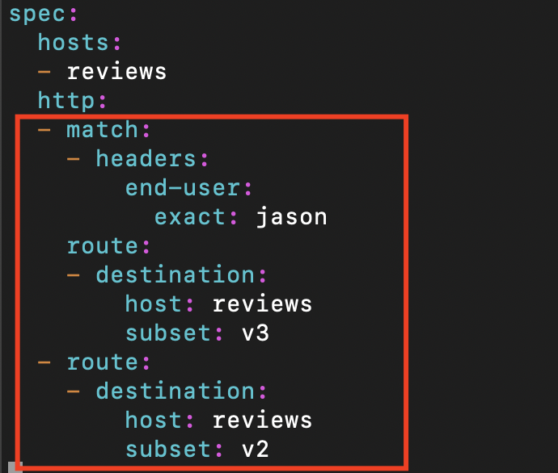
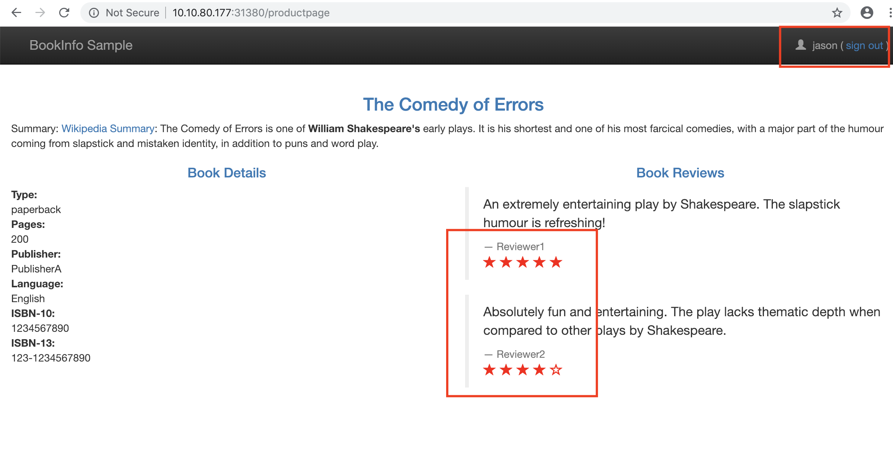

# Istio 기초 다지기

이번 기초 다지기 편에서는 샘플로 **[bookinfo](https://istio.io/docs/examples/bookinfo/)** 애플리케이션을 활용합니다.   
**bookinfo** 애플리케이션의 구조는 아래 그림과 같습니다.


## 1. Istio sidecar 주입 (injection) 설정
배포되는 애플리케이션 컨테이너를 istio service mesh 에서 관리 하도록 하기 위해서는 sidecar를 주입해야 하는데,
sidecar는 아래 두가지 방법으로 배포가 가능합니다.

* 수동 주입 - 애플리케이션 컨테이너 배포시 sidecar를 함께 배포
* 자동 주입 - 특정 namespace 에 애플리케이션 컨테이너 배포시 별도의 명령어 없이 sidecar가 자동 주입 되도록 label 설정

이 중에서 이번 튜토리얼에서는 **auto injection** 을 설정해 봅니다.

1. `default` namespace 정보 확인
~~~
kubectl describe namespace default
~~~

2. `default` namespace에 `istio-injection=enabled` 값 설정
~~~
kubectl label namespace default istio-injection=enabled
~~~

3. label이 반영된 namespace 정보 확인
~~~
kubectl describe namespace default
~~~


4. 이제 간단하게 예제 애플리케이션을 배포 가능
~~~
kubectl apply -f [bookinfo.yaml](./bookinfo/bookinfo.yaml)
~~~


5. 배포된 애플리케이션과 서비스 확인
~~~
kubectl get pods
kubectl get services
~~~


6. 웹 대시보드에서도 동일하게 확인


7. 배포된 Pod에 Sidecar가 자동 주입되었음을 확인
특정 서비스 클릭해 Pod 상세 정보 확인시 Sidecar가 기존 애플리케이션 Pod 내에 별도의 컨테이너로 주입되었음을 확인


## 2. Bookinfo 애플리케이션 접속하기 - Gateway, VirtualService 정의
이제 Bookinfo 서비스가 실행 되고 있습니다.
애플리케이션을 Kubernetes 클러스터 외부에서 접속하도록 하기 위해서는 **Istio Gateway** 를 사용해야 합니다.

1. 배포한 애플리케이션에 대한 ingress gateway를 정의   
[bookinfo-gateway.yaml](./bookinfo/bookinfo-gateway.yaml)  
[bookinfo-virtualservice.yaml](./bookinfo/bookinfo-virtualservice.yaml)

  ```
kubectl apply -f bookinfo-gateway.yaml
kubectl apply -f bookinfo-virtualservice.yaml
```

2. `gateway` 와 `Virtual Service`가 생성되었음을 확인
```
kubectl get gateway -n default
```
```
kubectl get virtualservice -o yaml
```

3. Ingress를 통해 서비스에 접속
```
export INGRESS_HOST=$(kubectl get po -l istio=ingressgateway -n istio-system -o 'jsonpath={.items[0].status.hostIP}')
echo $INGRESS_HOST
```
저는 외부 Load balancer가 없는 테스트 환경이므로 NodePort를 통해 서비스에 접속하도록 합니다.
```
export INGRESS_PORT=$(kubectl -n istio-system get service istio-ingressgateway -o jsonpath='{.spec.ports[?(@.name=="http2")].nodePort}')
echo $INGRESS_PORT
```
```
export GATEWAY_URL=$INGRESS_HOST:$INGRESS_PORT
echo $GATEWAY_URL
```
저의 경우, http://<proxynode-ip>:31380 로,
http://10.10.80.177:31380 가 접속 URL 입니다.  

  애플리케이션 실행 여부를 확인하기 위해 아래와 같이 curl 명령어를 실행합니다.
  ```
  curl -o /dev/null -s -w "%{http_code}\n" http://${GATEWAY_URL}/productpage
  ```

  

4. 브라우저에서 서비스 화면 확인
브라우저 주소창에 `http://${GATEWAY_URL}/productpage`  을 입력하면 실행 서비스를 확인할 수 있습니다.
새로고침 할 때마다 Book reviews 화면이 변경되는 것을 확인 할 수 있습니다.

  


## 3. Bookinfo 트래픽 관리

### 3-1. Destination rule 정의
Istio로 Bookinfo 버전을 제어하기 위해서는 먼저 버전을 _subset_ 이라고 부르는 `destination rules`에 정의 해야 합니다.
Bookinfo services에 대한 디폴트 `destination rules`을 정의하기 위해 아래의 명령어를 실행합니다.

```
kubectl apply -f reviews-dest-rules.yaml
```

### 3-2. Traffic Routing
이제 트래픽 라우팅에 대한 규칙을 정의해 봅니다.

먼저, `productpage`에서 `reviews-v1`만 호출하는 서비스 규칙을 정의합니다.

1. `VirtualService`에 호출 서비스 버전 (subset)을 v1 으로 정의

```
apiVersion: networking.istio.io/v1alpha3 kind: VirtualService
metadata:
  name: reviews-virtualservice
spec:
  hosts:
  - reviews
  http:
  - route:
    - destination:
        host: reviews
        subset: v1
```

```
kubectl apply -f reviews-virtualservice.yaml
```

2. productpage 를 웹 브라우저 상에서 여러번 호출해도 reviews 에 별표시가 없는 v1 만 호출됨을 확인


3. v2 만 호출하도록 규칙 수정
`subset`필드 값을 `v1`에서 `v2`로 수정 후 업데이트
```
vi reviews-virtualservice.yaml
```

```
kubectl replace -f reviews-virtualservice.yaml
```  
다시 브라우저 상에서 화면을 새로고침 하면 이제 검정색 별이 있는 v2 서비스만 호출됨을 확인


### 3-3. Traffic Splitting
이제 서비스 호출시 Traffic Splitting을 수행하도록 규칙 정의를 변경해 보겠습니다. 요청의 50%는 `reviews-v2` 로, 나머지 50%는 `reviews-v3`로 나뉘도록 합니다.
1. `Virtual Service` 에 두 개의 destination과 비율을 지정
```
vi reviews-virtualservice.yaml
```
```
apiVersion: networking.istio.io/v1alpha3
kind: VirtualService
metadata:
  name: reviews-virtualservice
spec:
  hosts:
  - reviews
  http:
  - route:
    - destination:
        host: reviews
        subset: v2
      weight: 50
    - destination:
        host: reviews
        subset: v3
      weight: 50
```
```
kubectl replace -f reviews-virtualservice.yaml
```
2. 브라우저에서 여러번 새로고침 하여 v2 와 v3 로 라우팅 되는 비율 확인


### 3-4. 사용자 기반 Traffic steering
특정 사용자 (jason) 으로 로그인시 `reviews-v3`서비스로, 그렇지 않으면 `reviews-v2` 서비스로 라우팅 되도록 트래픽 규칙을 정의합니다.

1. Virtual Service 정의 수정
```
vi reviews-virtualservice.yaml
```
```
apiVersion: networking.istio.io/v1alpha3
kind: VirtualService
metadata:
  name: reviews-virtualservice
spec:
  hosts:
  - reviews
  http:
  - match:
    - headers:
        end-user:
          exact: jason
    route:
    - destination:
        host: reviews
        subset: v3
  - route:
    - destination:
        host: reviews
        subset: v2
```

2.  VirtualService 업데이트
```
kubectl replace -f reviews-virtualservice.yaml
```


3. 브라우저에서 새로고침 후 검은색 별 (v2)이 나타남을 확인 후, `jason`으로 로그인하여 v3 서비스가 호출됨을 확인


    

    


### 3-4. Request Timeouts
이번에는 Istio를 사용해 Envoy 에서 요청에 대한 Timeout을 설정해 보겠습니다.

http 요청에 대한 타임아웃은 `router rule` 의 _timeout_ 필트에서 명시할 수 있습니다.
디폴트로, timeout은 15초이나 본 예제에서는 `reviews` 서비스 호출시 2초의
  


[Istio Request Timeout 참고 링크](https://istio.io/docs/tasks/traffic-management/request-timeouts/)


### 3-5. Fault Injection
[Istio Fault Injection 참고 링크](https://istio.io/docs/tasks/traffic-management/request-timeouts/)

특정 사용자 Jason 에게 `reviews` 서비스를 501 상태로 표시해 보겠습니다.

1. VirtualService 에서 `abort`값을 입력 (delay 값 대신)

```
kind: VirtualService
metadata:
  name: reviews-virtualservice
spec:
  hosts:
  - reviews
  http:
  - match:
    - headers:
        end-user:
          exact: jason
    fault:
      abort:
        percent: 100
        httpStatus: 501
    route:
    - destination:
        host: reviews
        subset: v3
  - route:
    - destination:
        host: reviews
        subset: v2
```
2.`jason`으로 로그인 한 상태에서 reviews 서비스가 501 상태로 호출되지 않음을 확인


Circuit Breaker
