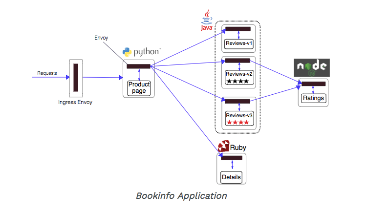

# Istio 기초 다지기

이번 기초 다지기 편에서는 샘플로 **[bookinfo](https://istio.io/docs/examples/bookinfo/)** 애플리케이션을 활용합니다.   
**bookinfo** 애플리케이션의 구조는 아래 그림과 같습니다.





## 1. Istio sidecar 주입 (injection) 설정
배포되는 애플리케이션 컨테이너를 istio service mesh 에서 관리 하도록 하기 위해서는 sidecar를 주입해야 하는데,
sidecar는 아래 두가지 방법으로 배포가 가능합니다.

* 수동 주입 - 애플리케이션 컨테이너 배포시 sidecar를 함께 배포
* 자동 주입 - 특정 namespace 에 애플리케이션 컨테이너 배포시 별도의 명령어 없이 sidecar가 자동 주입 되도록 label 설정

이 중에서 이번 튜토리얼에서는 **auto injection** 을 설정해 봅니다.

1. `default` namespace 정보 확인
~~~
kubectl describe namespace default
~~~

2. `default` namespace에 `istio-injection=enabled` 값 설정
~~~
kubectl label namespace default istio-injection=enabled
~~~

3. label이 반영된 namespace 정보 확인
~~~
kubectl describe namespace default
~~~


4. 이제 간단하게 예제 애플리케이션을 배포 가능
~~~
kubectl apply -f [bookinfo.yaml](./bookinfo/bookinfo.yaml)
~~~


5. 배포된 애플리케이션과 서비스 확인
~~~
kubectl get pods
kubectl get services
~~~


6. 웹 대시보드에서도 동일하게 확인


7. 배포된 Pod에 Sidecar가 자동 주입되었음을 확인
특정 서비스 클릭해 Pod 상세 정보 확인시 Sidecar가 기존 애플리케이션 Pod 내에 별도의 컨테이너로 주입되었음을 확인


## 2. Bookinfo 애플리케이션 접속하기
이제 Bookinfo 서비스가 실행 되고 있습니다.
애플리케이션을 Kubernetes 클러스터 외부에서 접속하도록 하기 위해서는 **Istio Gateway** 를 사용해야 합니다.

1. 배포한 애플리케이션에 대한 ingress gateway를 정의
[bookinfo-gateway.yaml](https://raw.githubusercontent.com/istio/istio/release-1.0/samples/bookinfo/networking/bookinfo-gateway.yaml)

```
kubectl apply -f bookinfo-gateway.yaml
```

2. `gateway` 와 `Virtual Service`가 생성되었음을 확인
```
kubectl get gateway -n default
```
```
kubectl get virtualservice -o yaml
```

3. Ingress를 통해 서비스에 접속
```
export INGRESS_HOST=$(kubectl get po -l istio=ingressgateway -n istio-system -o 'jsonpath={.items[0].status.hostIP}')
echo $INGRESS_HOST
```
저는 외부 Load balancer가 없는 테스트 환경이므로 NodePort를 통해 서비스에 접속하도록 합니다.
```
export INGRESS_PORT=$(kubectl -n istio-system get service istio-ingressgateway -o jsonpath='{.spec.ports[?(@.name=="http2")].nodePort}')
echo $INGRESS_PORT
```
```
export GATEWAY_URL=$INGRESS_HOST:$INGRESS_PORT
echo $GATEWAY_URL
```
저의 경우, http://<proxynode-ip>:31380 로,
http://10.10.80.177:31380 가 접속 URL 입니다.  

  애플리케이션 실행 여부를 확인하기 위해 아래와 같이 curl 명령어를 실행합니다.
  ```
  curl -o /dev/null -s -w "%{http_code}\n" http://${GATEWAY_URL}/productpage
  ```

  

4. 브라우저에서 서비스 화면 확인
브라우저 주소창에 `http://${GATEWAY_URL}/productpage`  을 입력하면 실행 서비스를 확인할 수 있습니다.
새로고침 할 때마다 Book reviews 화면이 변경되는 것을 확인 할 수 있습니다.

  


## 3. Istio Traffic Management


Circuit Breaker
