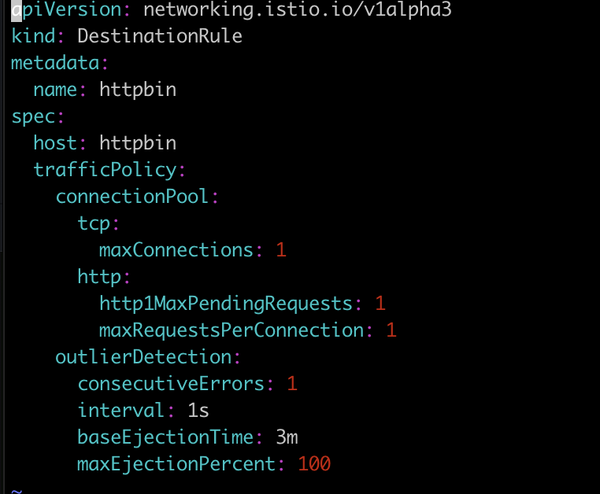
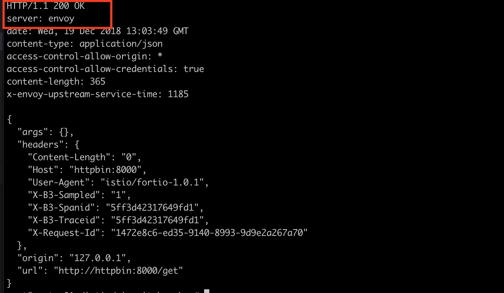
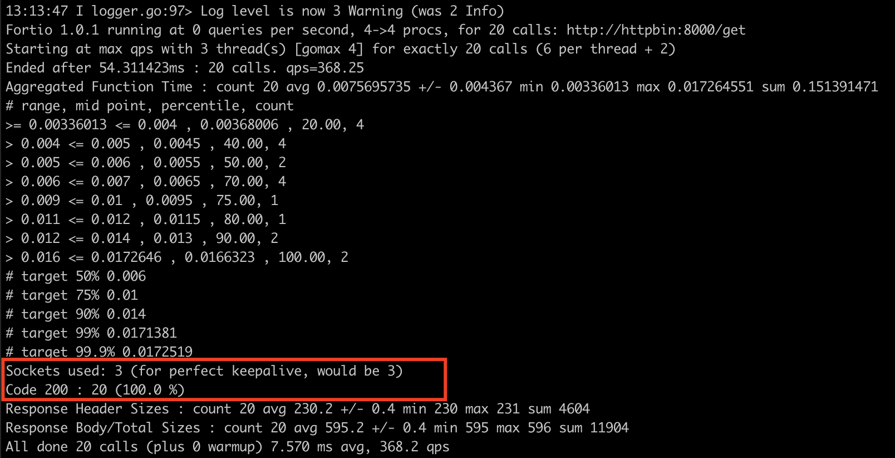
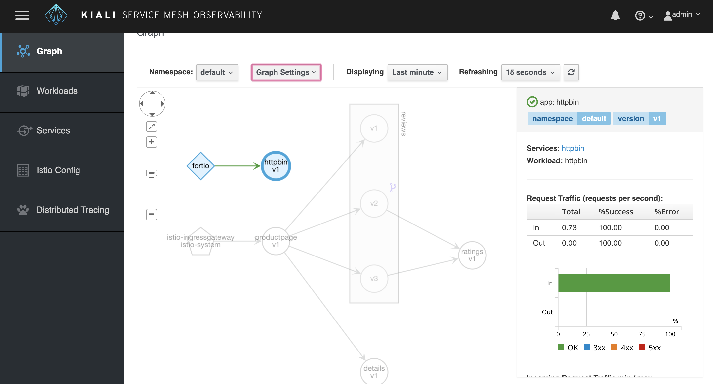
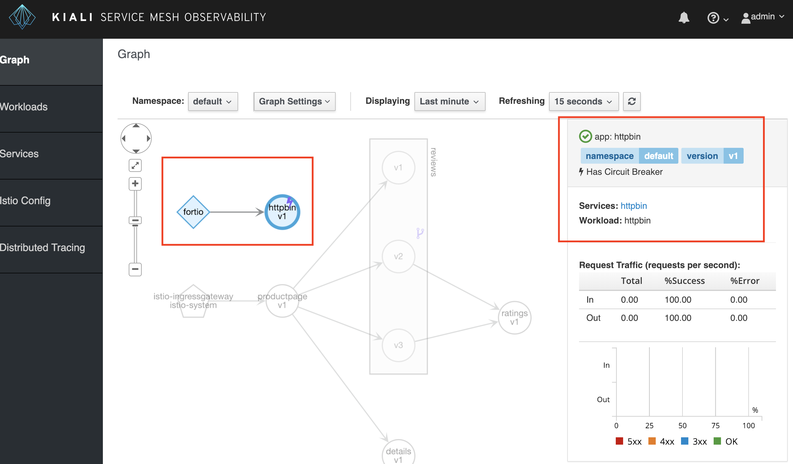
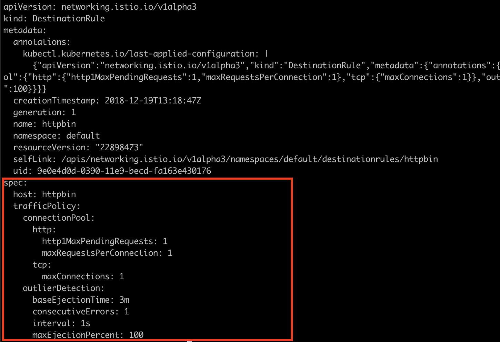
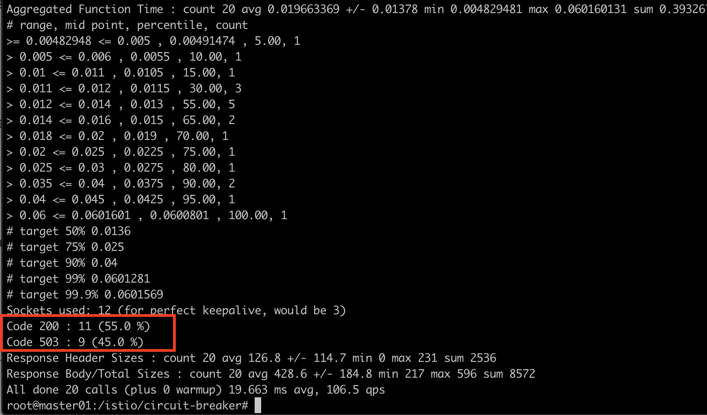
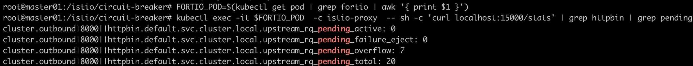

# Istio 기초 다지기 2- Circuit Breaker 편

이번 실습에서는 Istio 상에서 Circuit Breaker를 배포해봅니다.
본 튜토리얼은 Istio의 실습 예제 **[istio-circuitbreaker](https://istio.io/docs/tasks/traffic-management/circuit-breaking/)** 를 참고합니다.


## 1. 배포할 환경 구성하기
* httpbin: CircuitBreaker 정책을 적용할 대상 애플리케이션으로, 이미 Envoy를 주입하여 배포 완료된 상태
* fortio-client: `httpbin` 서비스로 트래픽을 전송하기 위한 클라이언트이며, 로드 테스팅 하는 툴

### 1-1. 대상 애플리케이션 (`httpbin`) 배포하기
1. `httpbin` Deployment 와 Service 배포하기   
[httpbin.yaml](./demo/httpbin.yaml)  
```
kubectl apply -f httpbin.yaml -n $NAMESPACE
```

2. `httpbin`의 `Destination Rule` 명시하기   
[httpbin-dest-rule-cb.yaml](./demo/httpbin-dest-rule-cb.yaml)
```
kubectl apply -f httpbin-dest-rule-cb.yaml
```



### 1-2. 로드 테스팅을 위한 `fortio` 클라이언트 배포
[fortio-deploy.yaml](./demo/fortio-deploy.yaml)
```
kubectl apply -f fortio-deploy.yaml
```

### 1-3. 서비스 정상 동작 확인

1. `Fortio` 를 통해 `httpbin` 이 정상적으로 트래픽을 처리함을 확인
```
export FORTIO_POD=$(kubectl get pod | grep fortio | awk '{ print $1 }')
```
```
kubectl exec -it $FORTIO_POD  -c fortio /usr/local/bin/fortio -- load -curl  http://httpbin:8000/get
```


  httpbin 서비스를 호출했음에도 envoy 프록시가 요청을 처리하며, 200 OK로 서비스 정상 호출됨을 확인


2. 동시 접속 (connection=3)에 대해 정상 처리됨을 확인
```
kubectl exec -it $FORTIO_POD  -c fortio /usr/local/bin/fortio -- load -c 3 -qps 0 -n 20 -loglevel Warning http://httpbin:8000/get
```


3. Kiali 서비스에서 서비스 트래픽 확인


4. Circuit breaker 규칙 정의 (DestinationRule로 정의됨)  

  httpbin 서비스에 대한 traffic policy 정의
```
kubectl apply -f ./httpbin-dest-rule-cb.yaml
```

```
kubectl get destinationrule httpbin -o yaml
```  
정의된 DestinationRule 확인
  
현재 maxConnections: 1, http1MaxPendingRequests:1 이므로 한 개connection을 초과하고 동시적으로 요청이 들어올 경우 istio-proxy가 그 이후의 요청과 connection에 대해서는 circuit을 열어 회로 차단을 함.

5. 세 개 동시의 connection으로 서비스를 호출하고 20개의 요청 전송
```
kubectl exec -it $FORTIO_POD  -c fortio /usr/local/bin/fortio -- load -c 3 -qps 0 -n 20 -loglevel Warning http://httpbin:8000/get
```
  
55%의 트래픽만 수용되며, 나머지 요청은 circuit breaking에 의해 거부됨

6. Fortio Pod 내  Istio-proxy 의 stat의 정보 확인
```
kubectl exec -it $FORTIO_POD  -c istio-proxy  -- sh -c 'curl localhost:15000/stats' | grep httpbin | grep pending
```

7 개의 요청이 circuit breaking에 의해 pending overflow 처리 되었음을 확인

7. 자원 삭제
```
kubectl delete destinationrule httpbin
FORTIO_POD=$(kubectl get pod | grep fortio | awk '{ print $1 }')
kubectl delete po $FORTIO_POD
```
