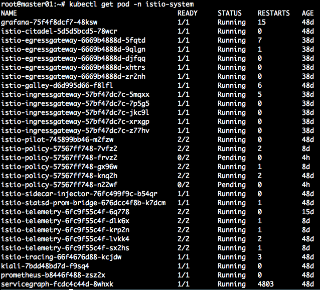
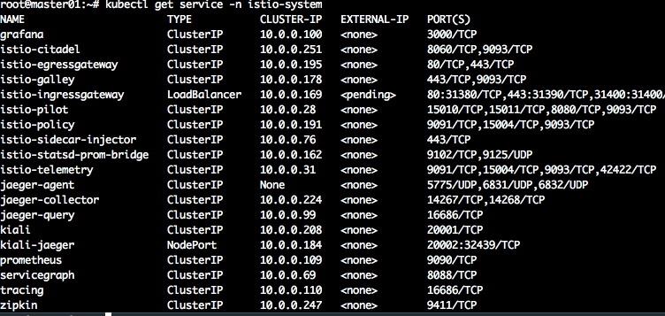
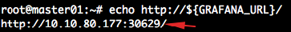
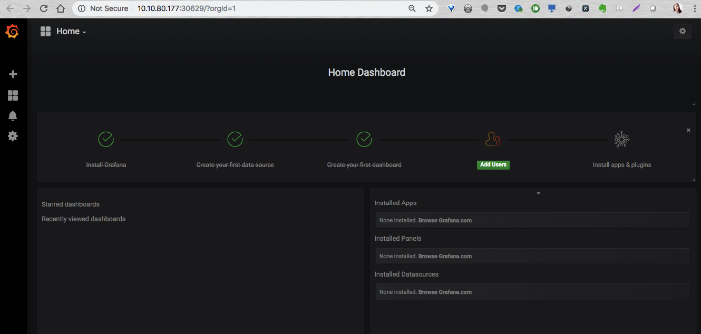
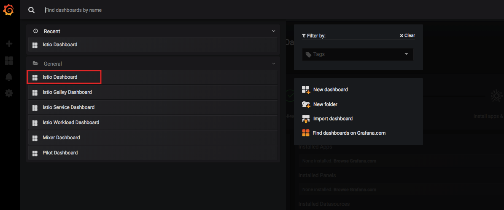
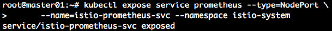
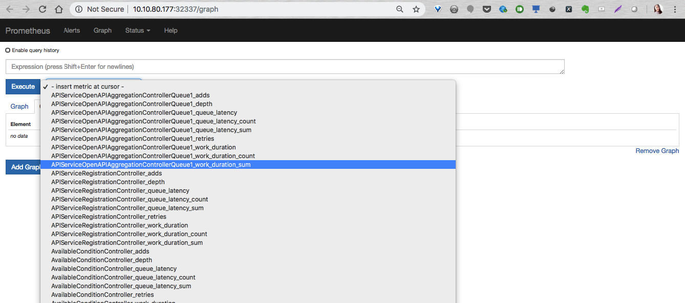
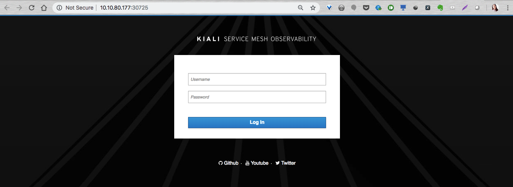
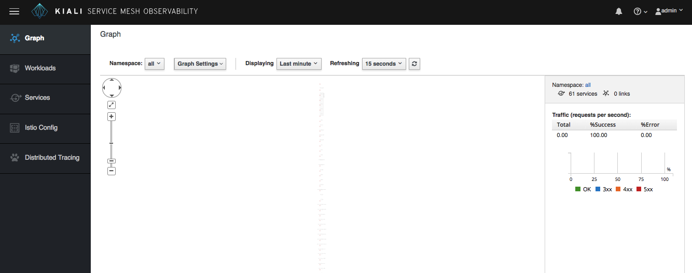
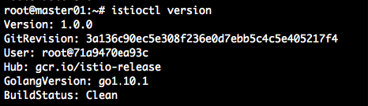

# Istio 환경 설정하기

## 1. Istio (Service Mesh) 환경 설정 및 동작 확인
1. CLI에서 Kubernetes 환경에 로그인
~~~
cloudctl login --skip-ssl-validation
~~~
username/password : *admin*/*admin*
namespace : *default*

1. Istio 컴포넌트 확인
Istio 서비스 메쉬 컴포넌트는 `istio-system` 이라는 namespace에 위치함.
~~~
kubectl get pod -n istio-system
~~~

1. Istio 컴포넌트에 대한 서비스 확인
~~~
kubectl get service -n istio-system
~~~

**Istio-ingressgateway** 는 아래와 같이 포트 맵핑 되어 있는 것을 확인할 수 있음
* 80 포트 : 31380
* 443 포트 : 31390

1. 모니터링 툴을 외부로 expose 하여 접근 가능하도록 설정
* Istio 대시보드 (Grafana) 노출
~~~
kubectl expose service grafana --type=NodePort --name=istio-grafana-svc -n istio-system
~~~

~~~
export GRAFANA_URL=$(kubectl get po -l app=grafana -n \
      istio-system -o 'jsonpath={.items[0].status.hostIP}'):$(kubectl get svc \
      istio-grafana-svc -n istio-system -o \
      'jsonpath={.spec.ports[0].nodePort}')
~~~

~~~
echo http://${GRAFANA_URL}/
~~~

화면에 출력된 Grafana URL을 브라우저 주소창에 입력 후 접속하여 Istio 대시보드가 Grafana 에서 보여짐을 확인

좌측 상단의 **Home** 클릭해 대시보드 리스트 확인

* Promtheus 서비스 외부로 노출
~~~
kubectl expose service prometheus --type=NodePort \
      --name=istio-prometheus-svc --namespace istio-system
~~~

~~~
export PROMETHEUS_URL=$(kubectl get po -l app=prometheus \
      -n istio-system -o 'jsonpath={.items[0].status.hostIP}'):$(kubectl get svc \
      istio-prometheus-svc -n istio-system -o 'jsonpath={.spec.ports[0].nodePort}')
~~~

~~~
echo http://${PROMETHEUS_URL}/
~~~

* Kiali 서비스 외부로 노출
~~~
kubectl expose svc -n istio-system kiali --type=NodePort --name=istio-kiali-svc
~~~

~~~
export KIALI_URL=$(kubectl get po -l app=kiali -n istio-system -o 'jsonpath={.items[0].status.hostIP}'):$(kubectl get svc istio-kiali-svc -n istio-system -o 'jsonpath={.spec.ports[0].nodePort}')
~~~

~~~
echo $KIALI_URL
~~~

username/password : *admin*/*admin*

2. istioctl 설치하기
2-1. 최신 버전 istioctl 다운로드
~~~
export ISTIO_VERSION=1.0.4
curl -L https://git.io/getLatestIstio | sh -
~~~

istioctl 설치됨을 확인
~~~
istioctl version
~~~

2-2. Istio 폴더로 이동
~~~
cd istio-1.0.2
export PATH=$PWD/bin:$PATH
~~~
